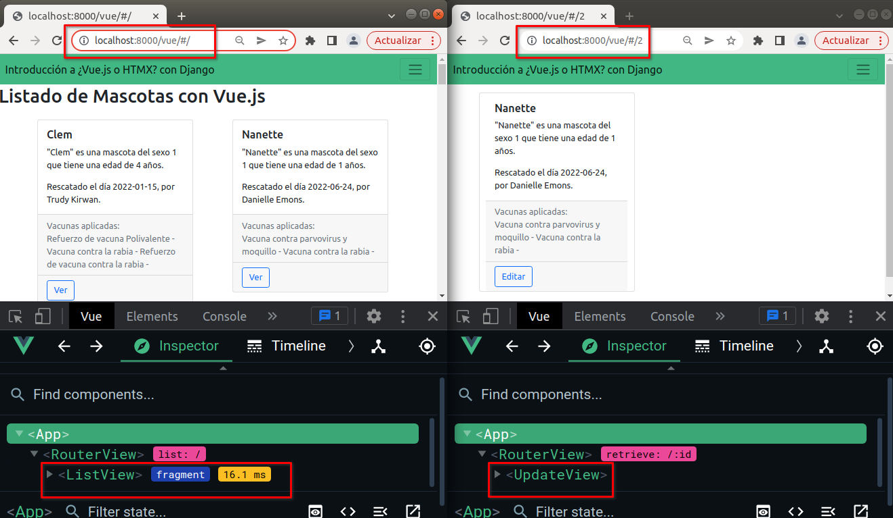
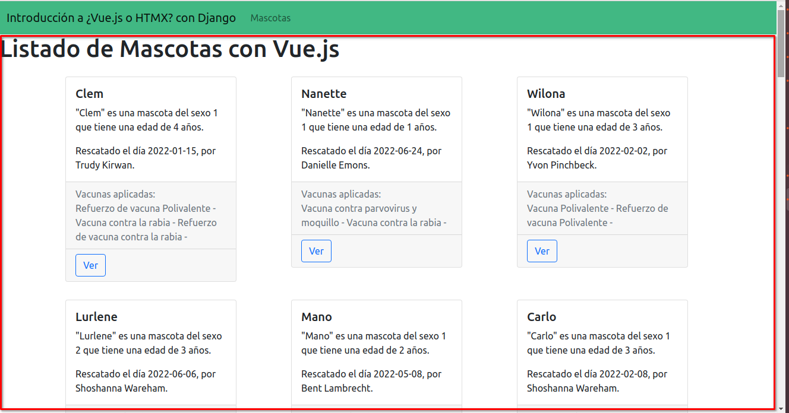
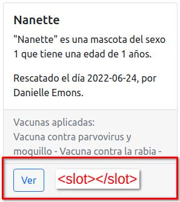
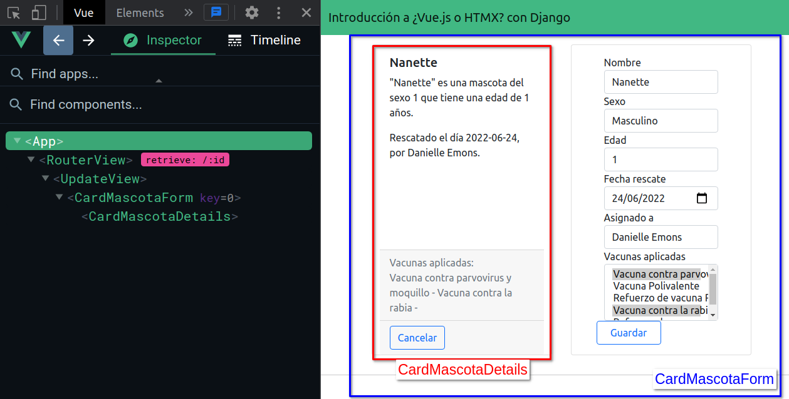
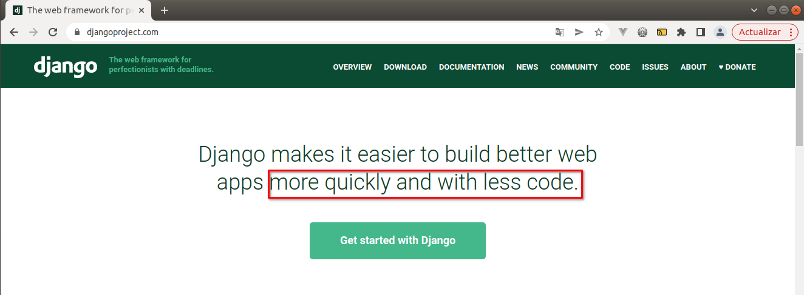

===========================
Cambios y mejoras en Vue.js
===========================

Vue Router
==========

Agregamos Vue Router para dividir la aplicación en diferentes rutas del navegador.
Con esto asignamos un componente de la aplicación a diferentes rutas de URL.

.. literalinclude :: ./../../../../vue/src/app/router/routes.js
   :language: js

Componente ListView - Listado de Mascotas
=========================================

**Archivo:** ``vue/src/app/views/ListView.vue``

- Sirve como componente principal, definido en el vue router, al entrar a la url '/'.
- Muestra un listado de las mascotas
    - Lo consigue realizando una petición con la libreria axios al API "/api/mascotas/".
    - Posteriormente, recorre la lista de mascotas y crea varios componentes llamados "CardMascotaDetails".
      Dicho componente recibe en los "props" los datos como: nombre, sexo, edad, fecha de rescate, etc.
- "Inyectamos" contenido dentro del componente "CardMascotaDetails".
    .. admonition:: Vue slots
        :class: important

        Un slot es como un fragmento de componente al cuál se le puede inyectar
        contenido permitiéndo anidar otros elementos dentro de él.

        .. imagen:: https://vuejs.org/assets/slots.dbdaf1e8.png

Componente CardMascotaDetails
=============================

**Archivo:** ``vue/src/app/components/CardMascotaDetails.vue``

- Componente simple para mostrar información de la mascota.
   - Lo consigue recibiendo la información en los "props" los datos como: nombre, sexo, edad, fecha de rescate, etc.

Componente UpdateView - Ver y actualizar información de una mascota
===================================================================

**Archivo:** ``vue/src/app/views/UpdateView.vue``

- Sirve como componente principal, definido en el vue router, al entrar a la url '/:id'.
- Inicialmente muestra información de la mascota con el id definido en la url.
   - Se muestra utilizando el componente anterior "CardMascotaDetails".
- Asi mismo, incorpora un formulario para permitir editar los datos de la mascota.

Un alma por un alma
===================

Al agregar Vue.js a nuestra aplicación incluimos:

- Aplicaciones "Web modernas" pero a costo de:
   - Tiempo en desarrollo de una API REST para exponer los recursos de nuestra aplicación.
   - Elaborar componentes de Vue.js haciendo más frontend que backend.
   - Lo anterior nos lleva a tener código más allá de lo necesario.
   - Debemos incluir validaciones en los serializers
   - De forma opcional, meter validaciones en los formularios de Vue.js.
   - Cuando el API responde un ``status 400`` por un campo incorrecto en el form, debemos ver la forma de poner los mensajes de errores en el input correspondiente.

- Perdimos:
   - El sistema de templates de Django
   - Las bondades y seguridad que nos ofrece los formularios de Django.

