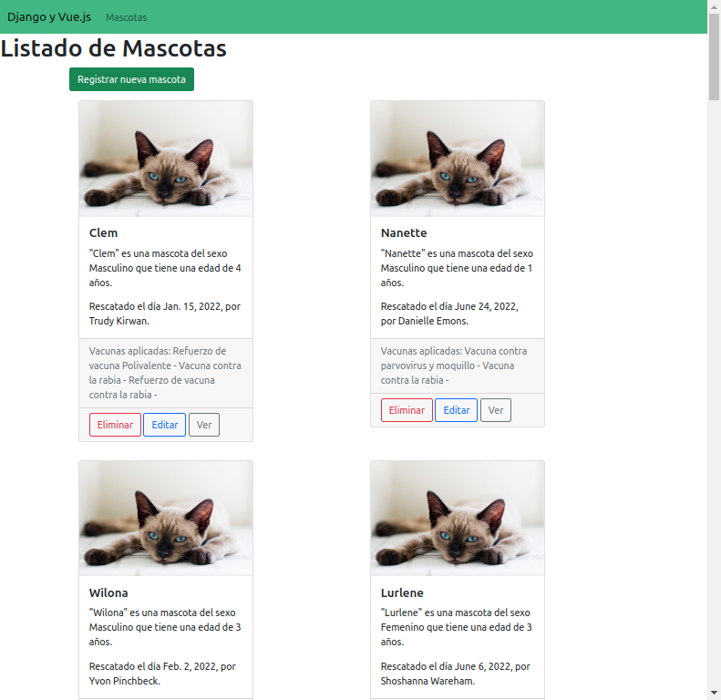

===================================================
Anteriormente en "Introducción a Vue.js con Django"
===================================================

Servidor de Django
==================

Modelos
~~~~~~~

.. literalinclude :: ./../../../src/apps/refugio/models.py
   :language: python

Vistas
~~~~~~
.. literalinclude :: ./../../../src/apps/refugio/views/django.py
   :language: python

.. admonition:: Proyecto en Django
    :class: important

    Con lo anterior, creamos una aplicación que realiza las acciones del
    CRUD (Create, Read, Update, Delete) sobre el modelo de "Mascota".

    Puede consultar la aplicación en el siguiente enlace
    `"Listado de Mascotas" </mascota/list/>`__.

Django REST Framework
=====================

Endpoints
~~~~~~~~~

.. literalinclude :: ./../../../src/apps/refugio/api/views.py
   :language: python

.. admonition:: Documentación del API
    :class: important

    Integrando "Django REST Framework" creamos rapidamente los endpoints
    que consume nuestra aplicación de Vue.js para consultar y mostrar la
    información del "Listado de mascotas".

    Puede consultar la documentación del API en los siguientes enlaces:
    `ReDoc </api/schema/redoc/>`__ o `Swagger </api/schema/swagger-ui/>`__

Vue.js
======

Componente "CardMascota"
~~~~~~~~~~~~~~~~~~~~~~~~~~~~~~~~~~~
.. image:: ./../../assets/ksnip_20220823-124106.png

Componente raíz llamado "App"
~~~~~~~~~~~~~~~~~~~~~~~~~~~~~~~~~~~~~~~~

