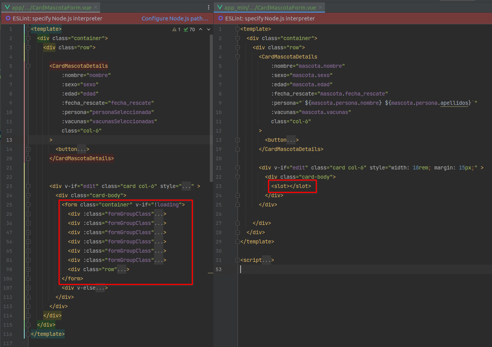
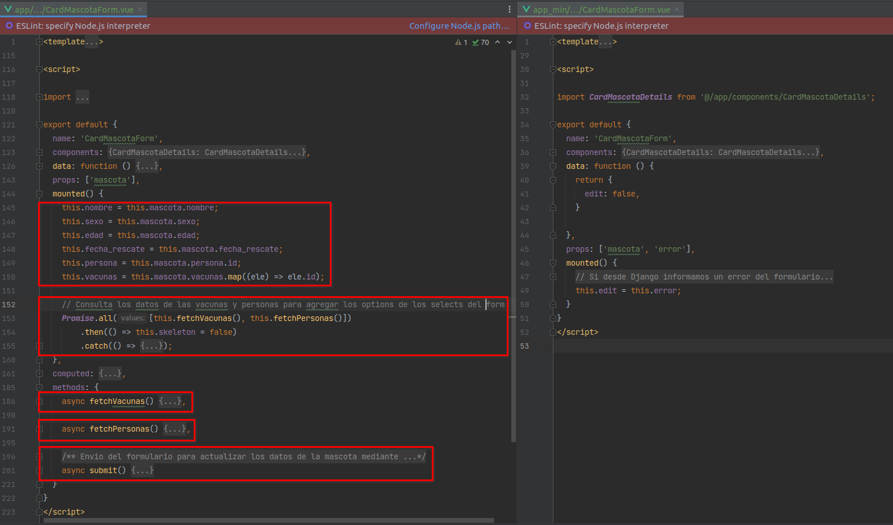

==============
Editar Mascota
==============

Modificaciones en Vue
=====================

**Archivo:** ``vue/src/app_min/main.js``

.. literalinclude :: ./../../../../../vue/src/app_min/main.js
   :language: js

Modificando del componente CardMascotaForm
~~~~~~~~~~~~~~~~~~~~~~~~~~~~~~~~~~~~~~~~~~

Como vimos anteriormente, los slots de Vue nos permitian "inyectar" contenido
dentro de nuestro componente.

Podemos aprovechar esta caracteristica de Vue, para incluir los formularios de
Django dentro de nuestro componente.

**Archivo:** ``vue/src/app_min/components/CardMascotaForm.vue``

Ya no hara falta realizar peticiones al API para obtener los recursos necesarios
para mostrar en el frontend. Django directamente nos lo proporcionara con las views,
sin consultar ningun recurso de API.

Modificaciones en Django
========================

Creando las vistas
~~~~~~~~~~~~~~~~~~

En la primera instancia de vue ``app`` el componente ``CardMascotaForm``
contenia dentro de el un formulario que creamos con Vue y que cuyos valores
se enviaban por ajax al API.

Lo que buscamos ahora, en la instancia de vue ``app_min``, es utilizar los
formularios de Django para eliminar el código adicional que se creo en el
javascript.

Para lograrlo, haremos uso de las vistas genericas de Django ``generic.FormView``.

**Archivo:** ``django/src/apps/refugio/views/vue/app_min/update.py``

.. literalinclude :: ./../../../../src/apps/refugio/views/vue/app_min/update.py
   :language: python

Creando el template
~~~~~~~~~~~~~~~~~~~

**Archivo:** ``django/src/templates/vue/app_min/update.html``

.. literalinclude :: ./../../../../src/templates/vue/app_min/update.html
   :language: html